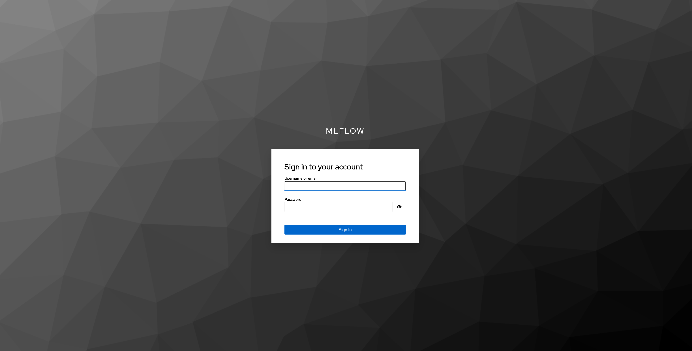
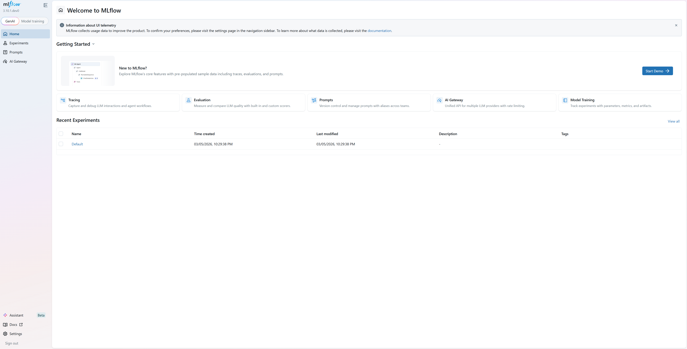
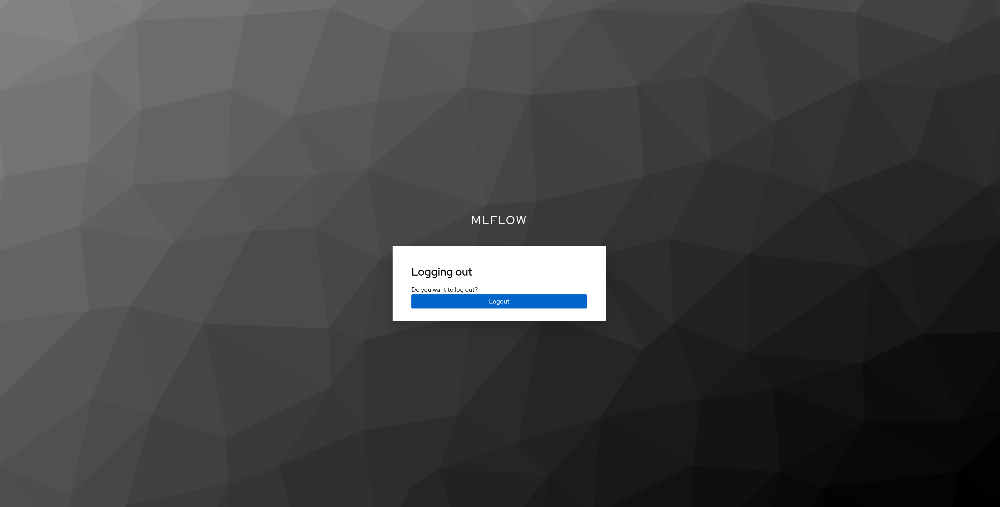

# MLflow OAuth Integration Test Environment

Local test setup for MLflow's OAuth/OIDC authentication and external authorization features. Uses Keycloak as the identity provider and PostgreSQL as the backend store.

## Prerequisites

- Docker and Docker Compose
- `uv` (Python package manager)
- `curl` (for health checks)

## Quick Start

```bash
# OAuth only (claims-based authorization from Keycloak groups)
make start-server-oauth

# OAuth + external authorization server
make start-server-ext-auth

# Stop everything
make stop-server-oauth
```

That's it. One command starts PostgreSQL, Keycloak, imports the realm with users and claim mappers, waits for everything to be ready, and launches the MLflow server with the OAuth plugin.

## What Gets Started

| Service         | URL                         | Credentials          |
| --------------- | --------------------------- | -------------------- |
| MLflow          | http://localhost:5000       | (via Keycloak SSO)   |
| Keycloak        | http://localhost:8080       | admin / admin        |
| Keycloak Admin  | http://localhost:8080/admin | admin / admin        |
| PostgreSQL      | localhost:5432              | mlflow / mlflow      |
| Ext Auth Server | http://localhost:9000       | (ext-auth mode only) |

## Test Users

All users are pre-created in Keycloak with passwords and group memberships:

| User    | Password   | Groups          | MLflow Role | What They Can Do                 |
| ------- | ---------- | --------------- | ----------- | -------------------------------- |
| alice   | alice123   | admins, editors | MANAGE      | Everything (admin)               |
| bob     | bob123     | editors         | EDIT        | Create/edit experiments & models |
| charlie | charlie123 | readers         | READ        | View experiments & models        |

## Two Modes

### OAuth Mode (`make start-server-oauth`)

Uses Keycloak OIDC with claims-based authorization. When a user logs in:

1. MLflow redirects to Keycloak for authentication
2. Keycloak returns an ID token with `preferred_username`, `email`, `groups` claims
3. MLflow maps groups to permissions via `role_mappings` in `oauth.ini`:
   - `readers` group -> `READ` permission
   - `editors` group -> `EDIT` permission
   - `admins` group -> `MANAGE` permission + admin flag
4. The highest permission wins when a user is in multiple groups

### External Auth Mode (`make start-server-ext-auth`)

Same as OAuth mode, but MLflow also calls an external authorization server before every permission check:

1. Authentication happens the same way (Keycloak OIDC)
2. For each API request, MLflow sends a POST to `http://localhost:9000/v1/check` with:
   ```json
   {
     "subject": { "username": "bob", "email": "bob@example.com", "provider": "oidc:keycloak" },
     "resource": { "type": "experiment", "id": "123", "workspace": "default" },
     "action": "read",
     "context": { "ip_address": "127.0.0.1", "timestamp": "..." }
   }
   ```
3. The external auth server evaluates its policy and returns:
   ```json
   { "allowed": true, "permission": "EDIT", "is_admin": false, "reason": "..." }
   ```
4. If the external server returns 404 (unknown resource type), MLflow falls back to its built-in RBAC

The external auth server (`ext_auth_server.py`) implements a simple group-based policy that mirrors the Keycloak group mappings. In a real deployment, this would be your custom authorization service (OPA, Cedar, Casbin, etc.).

## Token Claims

The Keycloak realm is configured with protocol mappers that inject these claims into the ID/access tokens:

| Claim                | Source                | Example                 |
| -------------------- | --------------------- | ----------------------- |
| `preferred_username` | Keycloak username     | `alice`                 |
| `email`              | User email            | `alice@example.com`     |
| `name`               | First + Last name     | `Alice Admin`           |
| `groups`             | Group membership      | `["admins", "editors"]` |
| `roles`              | Realm role assignment | `["mlflow-admin"]`      |

## Manual Testing

### Get a token via password grant (useful for API testing)

```bash
TOKEN=$(curl -s -X POST http://localhost:8080/realms/mlflow/protocol/openid-connect/token \
  -d 'grant_type=password&client_id=mlflow&client_secret=mlflow-client-secret' \
  -d 'username=alice&password=alice123&scope=openid profile email' \
  | python3 -c 'import sys,json;print(json.load(sys.stdin)["access_token"])')

# Use the token
curl -H "Authorization: Bearer $TOKEN" http://localhost:5000/api/2.0/mlflow/experiments/search
```

### Browser-based login

Open http://localhost:5000 in your browser. You'll be redirected to Keycloak's login page. Sign in with any of the test users above.

#### Screenshots

**Login page (Keycloak)**



**Home page (after login)**



**Logout**



### Inspect token claims

```bash
echo $TOKEN | python3 -c "
import sys, json, base64
token = sys.stdin.read().strip().split('.')[1]
token += '=' * (4 - len(token) % 4)
print(json.dumps(json.loads(base64.urlsafe_b64decode(token)), indent=2))
"
```

## Files

| File                  | Purpose                                        |
| --------------------- | ---------------------------------------------- |
| `docker-compose.yml`  | PostgreSQL + Keycloak containers               |
| `keycloak-realm.json` | Keycloak realm import (users, client, mappers) |
| `oauth.ini`           | MLflow config for OAuth-only mode              |
| `oauth-ext-auth.ini`  | MLflow config for OAuth + external auth mode   |
| `ext_auth_server.py`  | Python external authorization server           |
| `start.sh`            | Main startup script (used by Makefile)         |
| `stop.sh`             | Cleanup script                                 |

## Troubleshooting

**Keycloak takes too long to start**: First start downloads the image and initializes the database. Subsequent starts are faster. The script waits up to 4 minutes.

**"MLflow realm not found"**: The realm import might have failed. Check `docker compose logs keycloak` for errors. The realm JSON must be valid.

**"Could not get token for alice"**: Keycloak might still be processing the realm import. Wait a few seconds and try manually with the curl command above.

**Port conflicts**: Make sure ports 5000, 5432, 8080, and 9000 (ext-auth mode) are free. Run `make stop-server-oauth` to clean up previous runs.
